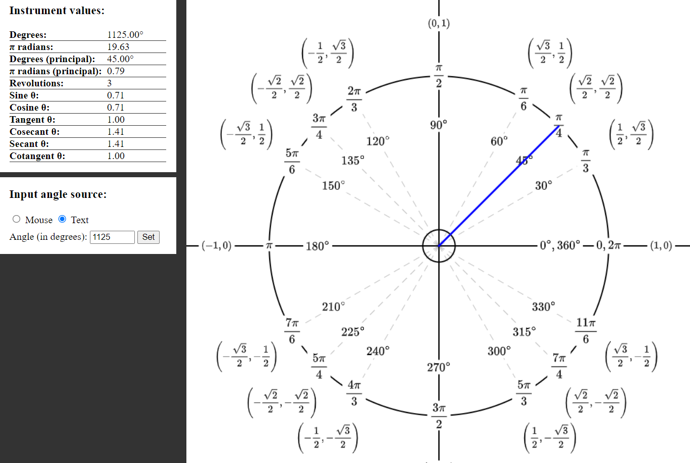

A tool for visualizing the unit circle used in trigonometry, displaying the special angles at multiples of pi/3 and pi/4 and their corresponding coordinate values. Written in HTML, CSS and JavaScript using MathJax to display mathematical equations and the native Canvas API for drawing the visuals.

The application uses the MathJax library to generate mathematical expressions (such as the coordinate points along the unit circle) based on text input in LaTeX notation, and outputs them in SVG format. The SVG elements are then encoded into base64 strings that can be rendered as images onto the native HTML \<canvas\> element.

